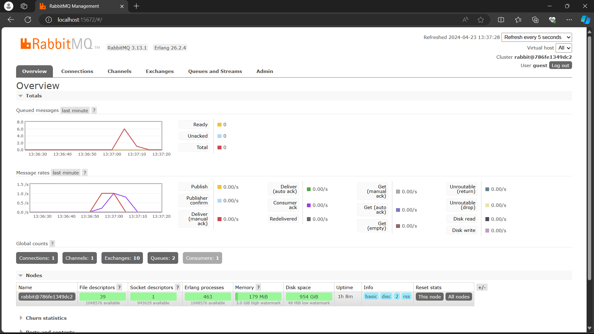

# what is amqp? 
amqp adalah standar untuk menyampaikan pesan antara aplikasi atau organisasi. aqmp akan saling menkoneksikan antar sistem yang ada. amqp biasanya digunakan sebagai _protocol_ di aplikasi _open-source_ pada tahap _development_.  

# what it means? guest:guest@localhost:5672 , what is the first guest, and what is the second guest, and what is localhost:5672 is for? 
* guest pertama: Mendeifinisikan _username_ untuk RabbitMQ
* guest kedua: Mendifinisikan _password_ untuk RabbitMQ
* localhost:5672: localhost berarti RabbitMQ akan dijalankan pada mesin lokal. 5672 berarti RabbitMQ server akan mendengerkan port 5672

# Simulation Slow Subscriber

Saya mencoba mensimulasikan slow subscriber dengan menambahkan thread sleep pada subscriber. Saya mencoba untuk membuat 1 subscriber dan 2 publisher. Pada kasus saya, saya menghasilkan 6 _queue messages_. Hal tersebut karena Publisher sudah mengirim data kepada RabbitMQ, tetapi Subscriber lama untuk menerimanya karena sleep. Sehingga, terjadi 6 _queue messages_.